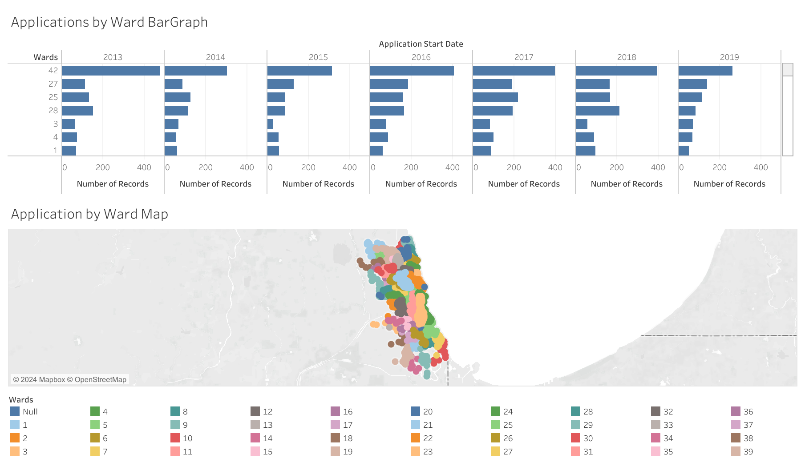

# Chicago-Film-Dashboard

# Tableau Dashboard: Applications by Ward in Chicago

## Overview
This repository contains a Tableau dashboard that visualizes the number of applications submitted by ward from 2013 to 2019. The dashboard consists of two main components: a bar graph showing application trends across multiple years and a map displaying the geographic distribution of applications by ward.

### Features:
- **Applications by Ward Bar Graph**: The bar graph provides a year-over-year breakdown of applications submitted in each ward. This makes it easy to identify which wards saw an increase or decrease in application submissions.
  
- **Applications by Ward Map**: The map visually displays the geographic spread of the applications, with each ward represented by a unique color.

## How to View:
To explore the dashboard, download the `.twbx` file and open it using [Tableau Desktop](https://www.tableau.com/products/desktop) or [Tableau Public](https://public.tableau.com/s/). You will be able to interact with the map and bar graph to analyze the data.

## Dashboard Preview:

## Data:
The data visualized in this dashboard consists of application records broken down by ward and year. It allows for a comprehensive analysis of where and when applications were submitted across different regions.
